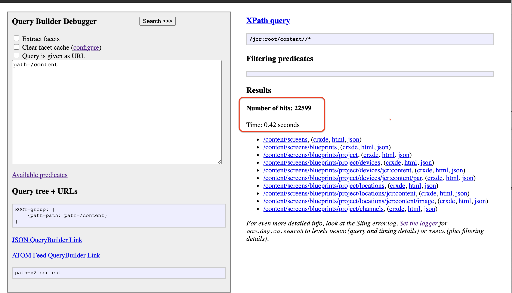

# Performance gains for large result sets

This experiment demonstrates the advantage of using [Query Builder's `p.guessTotal`](https://docs.adobe.com/content/help/en/experience-manager-65/developing/platform/query-builder/querybuilder-predicate-reference.html#root) parameter to return a subset of Query Builder query results.

## Problem

By default, Query Builder reads the entire result set to determine the total number of hits for a query which can be costly in terms of both execution time and memory usage for queries that have large result sets. In this experiment, we'll attempt to show the performance benefit of using the `p.guessTotal` parameter to avoid calculating the exact size of the full result set.

## Setup

AEM's QueryBuilder debugger tool will be used to execute [QueryBuilder-based](https://docs.adobe.com/help/en/experience-manager-65/developing/platform/query-builder/querybuilder-api.html) queries on the JCR (Java Content Repository).

## Test #1: `Calculate the exact total`

1. Navigate to AEM's QueryBuilder debugger tool at: http://localhost:4502/libs/cq/search/content/querydebug.html.

1. Find all items in the /content folder in the JCR by typing the following text in the text area:

```
   path=/content
```

- Select the `Search` button to execute the query.

 

- Make note of the total `Number of hits` and the `Time` it took the execute the query.

For demonstration purposes, the query is not indexed to show the performance gain more easily.

## Test #2: `Approximate the total`

Let's try this query again, but this time we'll specify a number to count up to for the total of hits.

1. Return to the Query Builder Debugger we used earlier and run the same query again with `p.guessTotal` set to `100`:

```
   path=/content
   p.guessTotal=100
```


Now we see that 100 results were read "and more" exist. There is no exact number of hits, and the query performs faster. That's better!

- Run the same query again with `p.guessTotal` set to `true`:

```
   path=/content
   p.guessTotal=true
```


Even better. Setting `p.guessTotal` to `true` means count up to [`p.limit`](https://docs.adobe.com/content/help/en/experience-manager-65/developing/platform/query-builder/querybuilder-predicate-reference.html#root) + [`p.offset`](https://docs.adobe.com/content/help/en/experience-manager-65/developing/platform/query-builder/querybuilder-predicate-reference.html#root) for the total number of hits, i.e., only count up to the minimum needed for the page. By default, `p.limit`= 10 and `p.offset` = 0.

## Conclusion

Okay, the performance improvement in query speed for this small result set was not that impressive. However, imagine if the query was more complex and there were hundreds of thousands of results then we would have seen a significant difference in the execution time. It is not always necessary to return a complete result set all at once. Use guessTotal for pagination or infinite scrolling, where only a subset of results are incrementally displayed.

For more details on the Query Builder API, including how to implement pagination, see the official [documentation](https://docs.adobe.com/help/en/experience-manager-65/developing/platform/query-builder/querybuilder-api.html).
