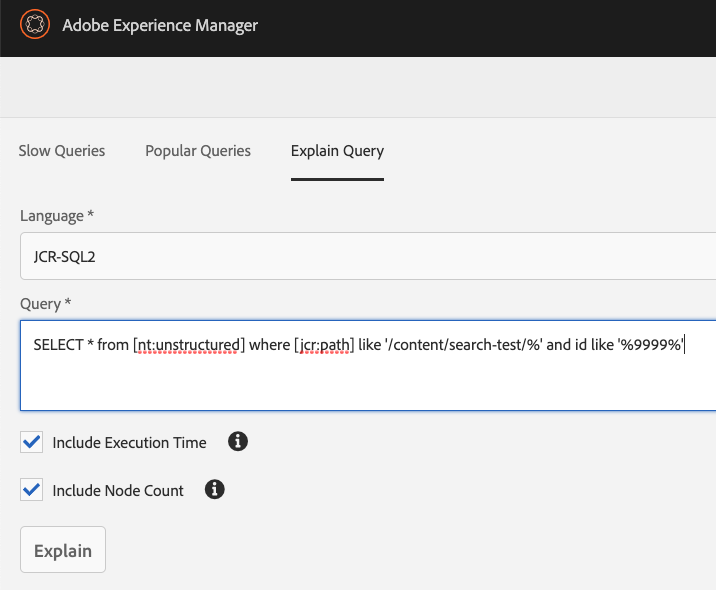
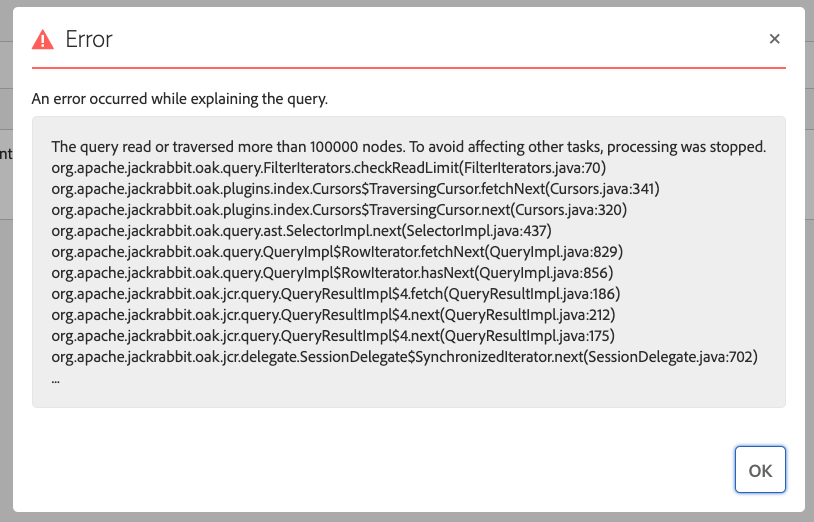
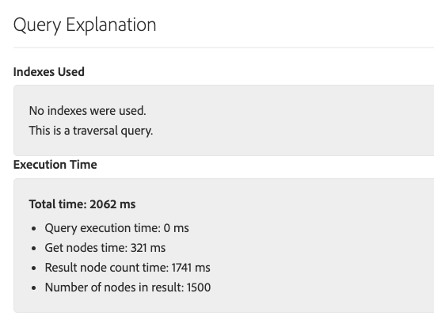
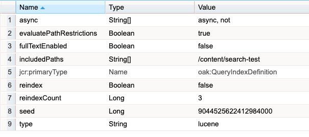
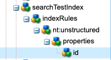
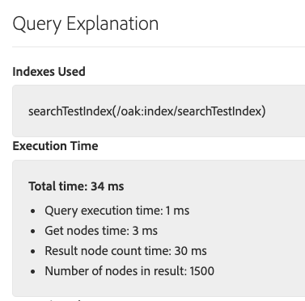

# Performance gains of a `Lucene property index`

This experiment demonstrates why, whenever possible, it is considered best practice to create an index for your search queries.

## Problem

Often, a slow running search can severely degrade the performance of a site, leading to out of memory issues, thread exhaustion, and simply a poor user experience. 
Therefore, care should be taken to create queries with this in mind.  In this experiment, we'll attempt to make clear why in most cases, creating indexes are an important part of the development process.

## Setup
We'll begin by installing some sample content consisting of 1500 nodes.  

1. In a terminal, run the bash script called [searchcontent.sh](searchcontent.sh) found alongside this readme to create our nodes.  *Windows Note:* Ensure you have cURL installed.  You may also have to fix End-of-Line markers.

2. You should now see the sample content under http://localhost:4502/crx/de/index.jsp#/content/search-test

## Test #1: `No indexing`

1. Navigate to AEM's Query Performance tool at: http://localhost:4502/libs/granite/operations/content/diagnosistools/queryPerformance.html 
then select the Explain Query tab.

2. Choose JCR-SQL2 from the query language selector and add the following query:

    `SELECT * from [nt:unstructured] where [jcr:path] like '/content/search-test/%' and id like '%9999%'`
    
    The above query will search for all unstructured nodes where the path begins with `/content/search-test/` and has an id property containing `9999`.  In this example all our nodes have an idea containing `9999`.
    
3. Ensure both "Include Execution Time" and "Include Node Count" are checked.  You should see the following...
    
    

4.  Run the query using the Explain button.

    Result:  ERROR!
    
    

    Notice we've reached the default node read limit in AEM of 100,000.  This is indeed a poor query!  
    
    AEM recommends an unindexed query traverses no more than 1000 nodes.  After that a warning is generated in the logs.  After 100,000 the query is aborted.
    
    Because no index is used, the Oak Search Engine is forced to go node by node looking for a suitable match.
    
    To demonstrate this further, let's temporarily override this readLimit in the next step.
    
4.  In a new tab, navigate to the Oak Query Engine Settings at: http://localhost:4502/system/console/jmx/org.apache.jackrabbit.oak%3Aname%3Dsettings%2Ctype%3DQueryEngineSettings and increase the LimitReads attribute value to 500000.  Save.
    
5.  Run the query again.

    Result:  SUCCESS...or is it?
   
    
    
    Yes, the query completed without error this time.  But notice the query explanation lets us know node traversal search was used (no index) with a time of over 2000ms to complete.
    While in this small example, it might seem acceptable to simply increase the readLimit, this clearly will not scale well
    on a large commercial site which typically have millions of nodes.
    
6.  Reset the LimitReads back to 100000 and save.

## Test #2: `Use a Lucene property index`
Let's try this query again, but this time we'll add a property index.  

Indexes are typically created via an [oak index generator](https://helpx.adobe.com/ca/experience-manager/kb/create-custom-oak-index.html) and maintained within an AEM project, but for the sake of simplicity here we've created a package containing
the needed node structure and property definitions.

1. Navigate to package manager at http://localhost:4502/crx/packmgr/index.jsp
2. Upload and install the [searchTestIndex.zip](searchTestIndex.zip) found alongside this readme.  If needed, visit the [documentation](https://helpx.adobe.com/ca/experience-manager/6-3/sites/administering/using/package-manager.html#PackageManager) for info on using Package Manager.

Let's take a look at what was just installed.  Navigate to http://localhost:4502/crx/de/index.jsp#/oak%3Aindex/searchTestIndex/
You should see properties similar to below...

Some of these properties are beyond the scope (see [documentation](https://helpx.adobe.com/ca/experience-manager/6-3/sites/deploying/using/queries-and-indexing.html#Configuringtheindexes) for more details), but for now let's focus on the fact that this node is of type `oak:QueryIndexDefinition` and will index nodes under the `/content/search-test`.  If you expand this node further you'll see we're indexing nodes of type `nt:unstructured` using the `id` property...

3. Return to the Explain Query tool we used earlier: http://localhost:4502/libs/granite/operations/content/diagnosistools/queryPerformance.html
and run the same query.

RESULT:  SUCCESS!

Now we see our index is in fact being used and the query performs much faster.  That's better!

## Conclusion

A lack of indexing is an all too common cause of poor site performance, especially as the site's content grows over time.
While indexing is not the solution for every situation, having some understanding of the concept and when to apply it is vital to a positive site experience.
For more on creating efficient indexes in AEM, check out: [Best Practices for Queries and Indexing](https://helpx.adobe.com/experience-manager/6-3/sites/deploying/using/best-practices-for-queries-and-indexing.html#TipsforCreatingEfficientIndexes).
