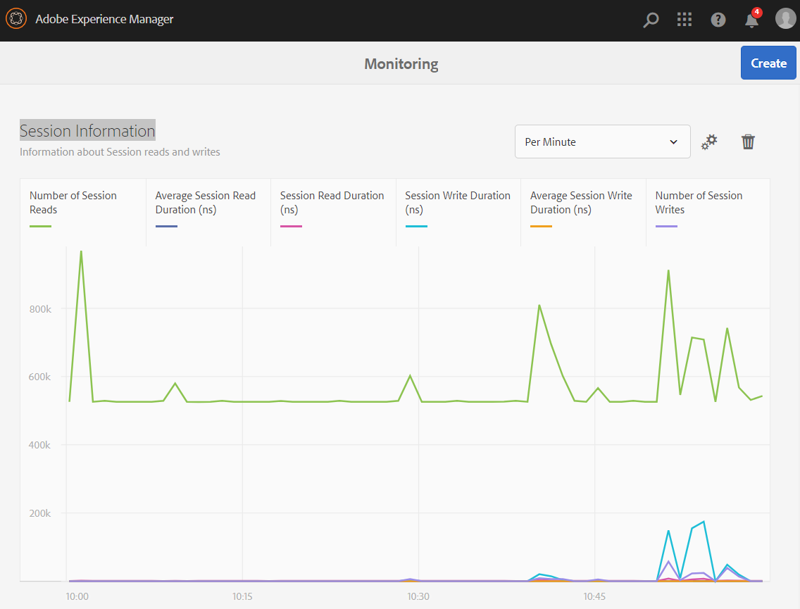

## Performance Impact of Changing the JCR Session Save Frequency

This experiment demonstrates the impact that the frequency of session save calls has on AEM's performance.

## Compatibility

This experiment is compatible with both AEM 6.5 and AEM as a Cloud Service.

## Setup

- Ensure you have followed the instructions in the main [README](../../README.md)
- Ensure your Maven settings.xml file includes a profile for the [Adobe Maven Repository](https://helpx.adobe.com/ca/experience-manager/kb/SetUpTheAdobeMavenRepository.html)
- Build and install the project code on your local author:
  1. Clone this Git repo to a local location
  1. In a console, navigate to the `aem-project` folder located in the project root (_created from the AEM Project Archetype_).
  1. Successfully build and install the package to your localhost's author instance by running `mvn -PautoInstallSinglePackage clean install`
  1. To verify the installation, open the [Session Writer Page](http://localhost:4502/content/aem-session-experiments/us/en/page-with-session-writer.html).
    - Give a few seconds for the packages and bundles to load in AEM.
- _Note_: Logging in as the administrator is optimal.

## Problem

Let's say you have some process that requires a lot of jcr node modifications in the current JCR session.  DAM Assets
may need marking. Node properties need updating.  Etc. Etc.  What if the number of these modifications are very high?
When should you save?  After each modification?  Some staggered frequency based on the number of saves?  Once at the
end?  Does it matter what change you are making - a property change, a node creation?  What affect does that have on
performance?  System Resources?  Your task's success rate?

## How to read the results

Each test will enter a JSON line in the results with the following properties:
- **writes**: how many "writes" or JCR modifications were performed during the test.
- **every**: how often a save was performed (every _n_ writes).  Enter "0" for one save at the end.
- **createNode**: whether to create a node for the 'write'.  If false, a property is changed.  Created nodes are deleted
at the end of the test.
- **duration**: the duration of the test in milliseconds.

The output of the servlet is that JSON snippet and could be used to perform many tests, piecing together the
results into a JSON array for evaluation and reporting.

## Permanent Settings

The page contains the component "sessionwriter" which should not have to be changed.  You can edit these more
permanent values by following these steps:
- [Open the page in the editor](http://localhost:4502/editor.html/content/aem-session-experiments/us/en/page-with-session-writer.html)
- Find the "Session Writer" component, select it.
- Edit it by clicking the pencil.
- See 3 values (endpoint, user name and password)
- Change those as you see fit, realizing the test may not work properly if these are modified.

## Test #1: Save often

For the first test, let's save after every change.  It might simply feel safer to save often.  Set the following values:
- **JCR Modifications to perform**: 5000 (or some large number)
- **JCR Modifications per commit**: 1
- Leave the checkbox unselected.
- Press the "Run Test" button 

The _Results_ textarea should eventually contain something like the following line:

`{"writes":5000,"every":1,"createNode":false,"duration":34820}`

That took a long time didn't it?  Did you worry it was not working correctly?

## Test #2: Save less often

For the second test, let's save less often.  Waiting that long was irritating!  Change the following values:
- **JCR Modifications per commit**: 10
- Press the "Run Test" button 

The _Results_ textarea should eventually add something like the following line:

`{"writes":5000,"every":10,"createNode":false,"duration":3469}`

That's surprisingly better!

## Test #3: Save once

For the third test, let's only save once.  Will it make a big difference?  Change the following values:
- **JCR Modifications per commit**: 0
- Press the "Run Test" button 

The _Results_ textarea should eventually add something like the following line:

`{"writes":5000,"every":0,"createNode":false,"duration":171}`

Woah.  That hardly took any time!  Is that the conclusion?  It is up to you to decide.  It's definitely better
for performance and ties up fewer system resources.  Occasional saves may help with confidence, and have less work
to do if the system fails during the task.

## Test #4: Create nodes and save often

Ok.  What is that checkbox about?  So far we have done simple changes to the JCR by modifying a property.  What
happens if we do a more substantial change, like creating a node?  Set the following values:
- **JCR Modifications to perform**: 5000
- **JCR Modifications per commit**: 1
- Check the checkbox
- Press the "Run Test" button 

The _Results_ textarea should eventually add something like the following line:

`{"writes":5000,"every":1,"createNode":true,"duration":61909}`

Back to a long wait.  We see node creation does take longer.

## Test #5: Create nodes and save less often
Change the following values:
- **JCR Modifications per commit**: 10
- Press the "Run Test" button 

The _Results_ textarea should eventually add something like the following line:

`{"writes":5000,"every":10,"createNode":true,"duration":32681}`

Better, but it still took a while.

## Test #6: Create nodes and save once
Change the following values:
- **JCR Modifications per commit**: 0
- Press the "Run Test" button 

The _Results_ textarea should eventually add something like the following line:

`{"writes":5000,"every":0,"createNode":true,"duration":698}`

That seems to be the winner as far as performance & system resources go.

## Monitoring

If you would like to see charts depicting the session activity, and if your user has administrator rights,
click the [Monitoring Page](http://localhost:4502/libs/granite/operations/content/monitoring/page.html) link at the
top of the page to see session statistics.  There you should see a "Session Information" table (installed with this
project) where general values can be monitored.

It should look something like this:

You could add more charts for information that you are interested in.

If you are interested in even more details, like threads usage, etc., you may want to run the above steps again with
[VisualVM](https://visualvm.github.io) attached to your instance.

## Conclusion

AEM, often using the TarMK persistence layer, is optimized for fast reads, but slower writes.  We have seen
its affect in the steps above.

Frequent saves of the session are expensive and should be avoided.  High number of saves will slow down the
task and tie up system resources, maybe to the point where a system become non-responsive or even shuts down.
Less frequent saves, allowing multiple changes to occur between is an improvement.  Saving once, when all
modifications are complete is the most efficient approach but should be implemented with caution, with an
awareness of the system resources like 

In the end, every system is unique in its processes, goals, resources, etc.  The developer needs to make an
intelligent, educated decision on the frequency of saves, leaning towards fewer saves.  The developer has
to keep transient space, where activities are stored before the session is saved, within a reasonable size
(see More Reading below for more in depth explanation).

Historically, the default of the Package manager is to save after 1000 modifications.  It has been carried
forward as the standard.

We hope this experiment, and series of tests, helped you to understand the nature of saves in relation to writes.

## Recommended Reading

- [Saving a Session within a Workflow](https://experienceleague.adobe.com/docs/experience-manager-65/developing/extending-aem/extending-workflows/workflows-best-practices.html?lang=en#process-sessions)
- [AEM transaction size or “do a save every 1000 nodes”](https://cqdump.wordpress.com/2017/08/30/aem-transaction-size-or-do-a-save-every-1000-nodes/)
